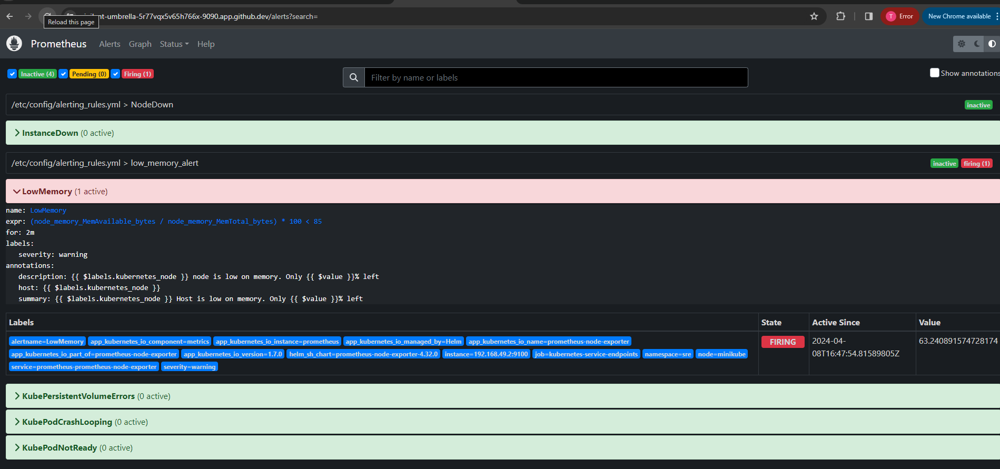

# Upcommerce Project
## Week-1

### Github Codespace running

### Upcommerce Website

### Alert Manager

### Prometheus

## Week-1 Optional Tasks

### Configure Email alerts

### Configure Slack alerts

## Week-2

[Week-2 Project Repo](https://github.com/aggarwal-tanushree/sre-week-two)

[Week-2 README.md](https://github.com/aggarwal-tanushree/sre-week-two/blob/599c1f1590b46ea0e4bb03b046b448f64f20fbd3/README.md)

### RCA Document
[Document](https://github.com/aggarwal-tanushree/sre-week-two/blob/e5e0ecbbfb40203b502030f3518e1ab2457e1e85/assets/TanushreeA-Fundamentals%20of%20SRE%20post-mortem.docx)

## Week-3

[Week-3 Project Repo](https://github.com/aggarwal-tanushree/sre-week-three-task)

[Week-3 README.md](https://github.com/aggarwal-tanushree/sre-week-three-task/blob/main/README.md)

